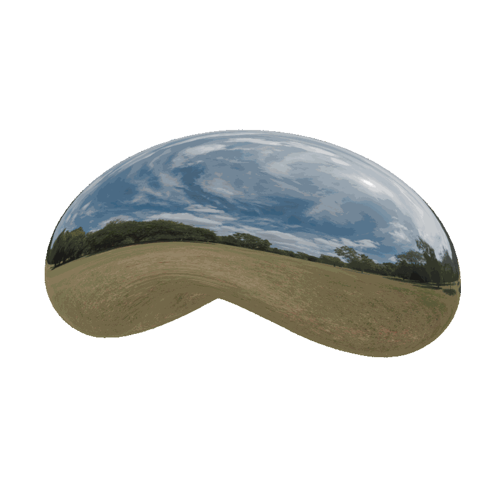
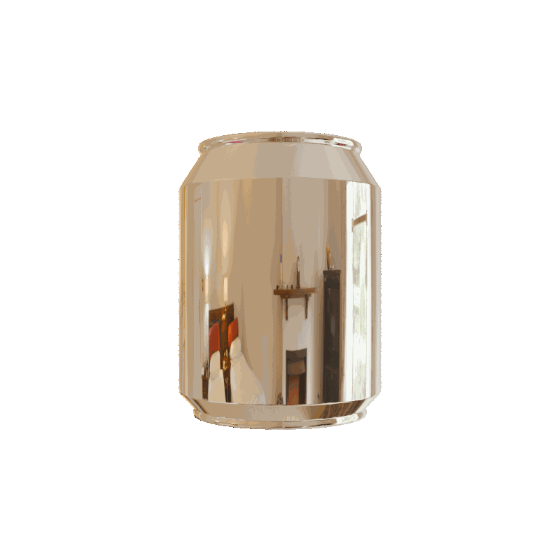
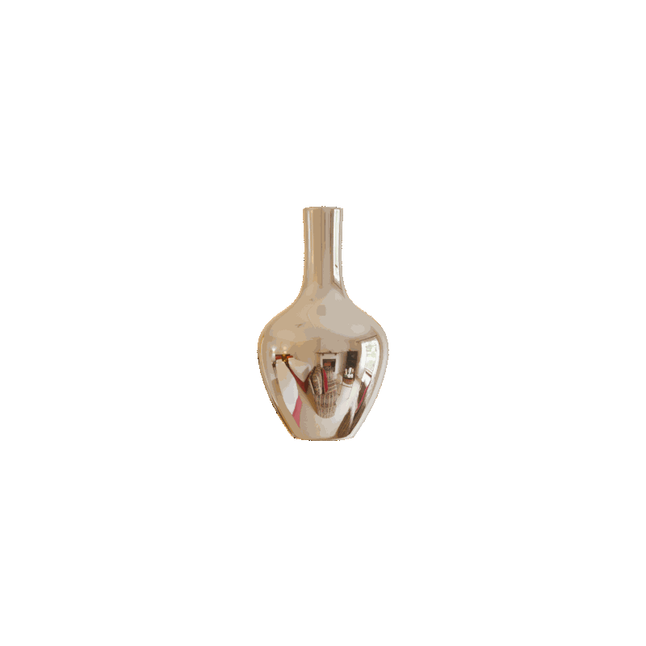

# 3D GSDR Dataset

Generate datasets for training 3D Gaussian Splatting models with multiple camera trajectory patterns.

<div align="center">
  
  
  
</div>

## Camera Trajectories

- **Golden Spiral**: Spherical distribution using golden ratio
- **Diamond**: Diamond-shaped path in configurable plane
- **Zigzag**: Z-shaped path in configurable plane

## Configuration

Edit `configs/single_obj.yaml` or `configs/multiple_obj.yaml`:

```yaml
camera:
  trajectory_type: "diamond"        # or "golden_spiral" or "zigzag"
  num_images: 300
  
  # Spherical trajectories
  distance: 7.0
  theta_min_deg: 25
  theta_max_deg: 85
  
  # Planar trajectories
  plane_distance: 12.0
  plane_normal: [0.707, 0.707, 0]   # [0,1,0] for XZ plane, [0.707,0.707,0] for 45° tilt
  diamond_size: 1.0
  zigzag_width: 2.0
  zigzag_height: 1.0
```

## Usage

```bash
cd ~/gs-dataset
blender --background --python render.py -- single_obj
```

Images and transforms saved to `output/` with train/test splits.