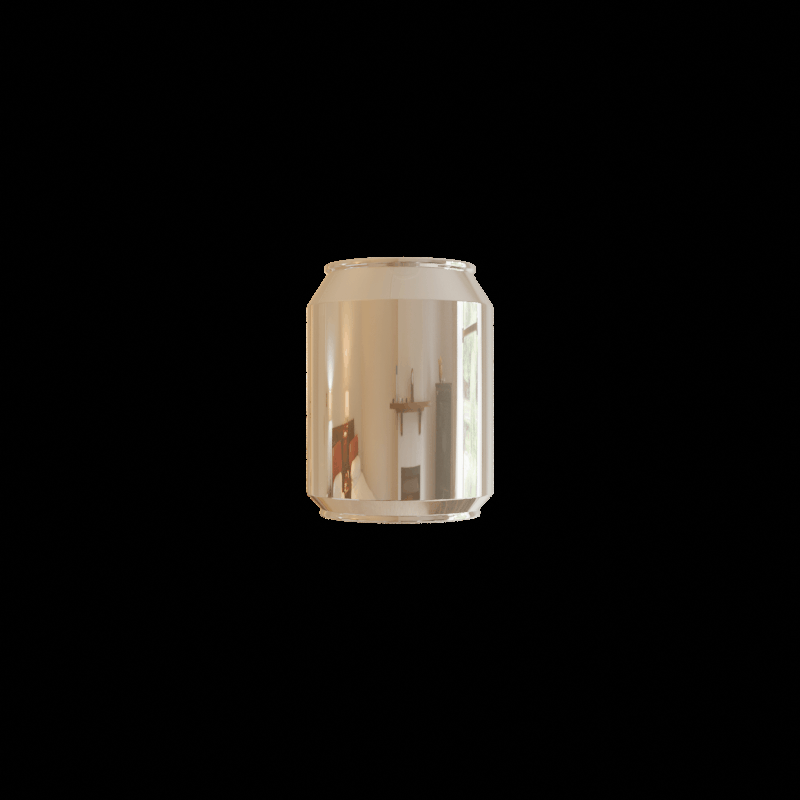

# 3D GSDR Dataset

The goal of this repository is to generate datasets for training 3D Gaussian Splatting models with multiple camera trajectory patterns. The system supports three different camera trajectories: golden spiral (spherical), diamond (planar), and zigzag (planar).

<div align="center">
  
  
  
</div>

## Setup

Install Blender in home directory:

```bash
cd ~
mkdir -p ~/software
cd ~/software
wget https://download.blender.org/release/Blender4.0/blender-4.0.0-linux-x64.tar.xz
tar -xf blender-4.0.0-linux-x64.tar.xz
```

Install PyYAML for Blender:

```bash
# find Blender's python
find ~/software/blender-4.0.0-linux-x64 -name "python*" | grep bin

# install PyYAML 
~/software/blender-4.0.0-linux-x64/4.0/python/bin/python3.10 -m pip install pyyaml
```

## Camera Trajectories

### Golden Spiral (Spherical)
- Even distribution of viewpoints on a sphere
- Uses golden ratio for optimal coverage
- Camera always looks at center

### Diamond (Planar) 
- Diamond-shaped path in a specified plane
- Camera maintains perpendicular view to plane
- Configurable plane orientation and size

### Zigzag (Planar)
- Z-shaped path in a specified plane  
- Three segments: horizontal → diagonal → horizontal
- Camera maintains perpendicular view to plane

## Configuration

Edit `configs/single_obj.yaml` or `configs/multiple_obj.yaml` to configure:

```yaml
camera:
  trajectory_type: "golden_spiral"  # or "diamond" or "zigzag"
  
  # For spherical trajectories
  theta_min_deg: 25
  theta_max_deg: 85
  phi_start_deg: 0
  phi_end_deg: 360
  distance: 7.0
  
  # For planar trajectories
  plane_distance: 12.0
  plane_normal: [0, 1, 0]  # XZ plane, or [0.707, 0.707, 0] for 45° tilt
  diamond_size: 1.0
  zigzag_width: 2.0
  zigzag_height: 1.0
```

## How to Run

```bash
# run from project root
cd ~/gs-dataset
~/software/blender-4.0.0-linux-x64/blender --background --python render.py -- single_obj
```

Output images and transform matrices will be saved in `output/` with train/test splits.

> Add `-- --cycles-device CUDA` at the end for GPU rendering